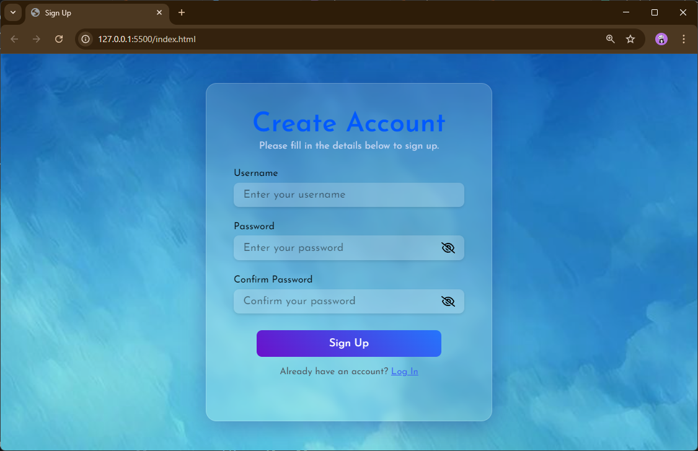
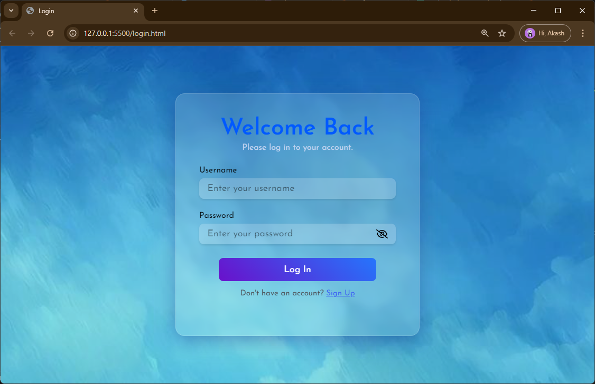
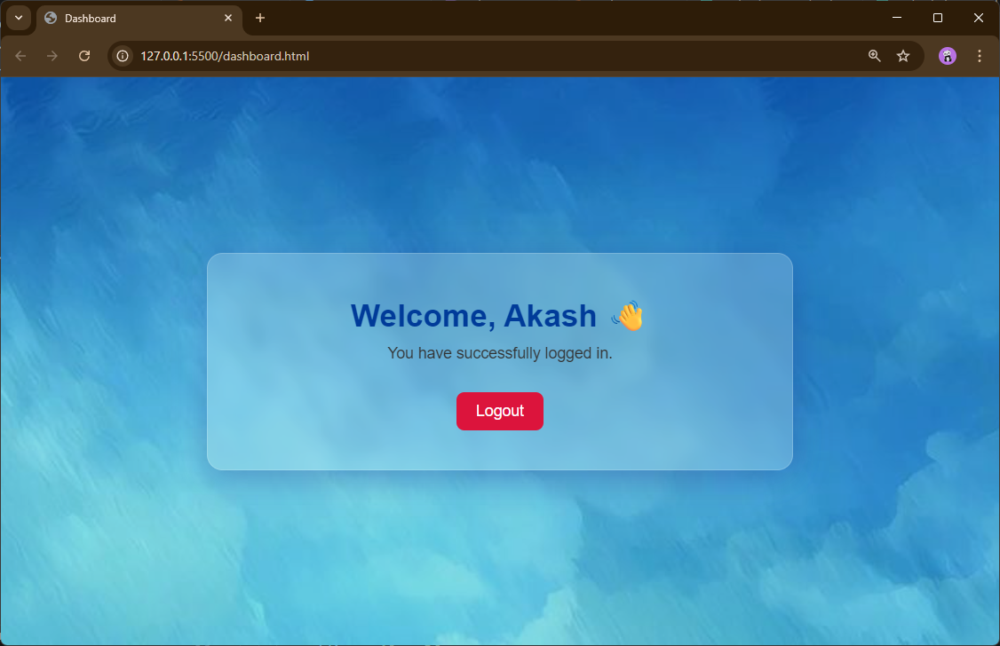

# 🔐 LoginFlow: Signup, Login & Dashboard with LocalStorage

🟢 [Live Demo](https://ak-yadav05.github.io/LoginFlow/)

This is a **responsive authentication UI** project built using **HTML, CSS, and JavaScript**, featuring:

- 👤 Sign Up Page with Validation  
- 🔒 Login Page with Secure Credential Check  
- 🎉 Animated Success Popups  
- 🧑‍💻 Dashboard with Dynamic Greeting  
- 💾 LocalStorage-based user data handling  
- 💎 Glassmorphism UI + Responsive Design

---

## 📸 Screenshots

| Sign Up | Login | Dashboard |
|--------|-------|-----------|
|  |  |  |

---

## 🚀 Features

- ✅ **Form Validation** with custom error messages  
- ✅ **LocalStorage Integration** to store user credentials  
- ✅ **Popup Animations** for success states  
- ✅ **Toggle Password Visibility** with eye icons  
- ✅ **Responsive Layout** for mobile and desktop  
- ✅ **Dashboard** shows a welcome message and logout option

---

## 🛠️ Technologies Used

- **HTML5**  
- **CSS3** with Glassmorphism and Animations  
- **JavaScript (Vanilla)**  
- **LocalStorage API**  

---

## 📁 Folder Structure

```
├── index.html           # Sign Up Page
├── login.html           # Login Page
├── dashboard.html       # Dashboard after login
├── style/
│   └── style.css        # Common styling for all pages
├── script/
│   ├── signup.js        # Handles signup validation + storage
│   └── login.js         # Handles login validation + redirect
├── images/
│   ├── bg.jpg           # Background image
│   ├── eye-open.svg     # Password visibility icon (open)
│   ├── eye-close.svg    # Password visibility icon (closed)
│   └── tick.png         # Tick image for signup success popup
```

---

## ✅ How It Works

1. User **signs up** – credentials are saved to `localStorage` in object format.
2. On **login**, the script checks `localStorage` for matching username/password.
3. If valid, a **success popup** appears and the user is redirected to the **dashboard**.
4. The dashboard shows a **personalized greeting** and a **logout** button.

---

## 📦 Installation / Run Locally

1. Clone the repository:
   ```bash
   git clone https://github.com/your-username/your-repo-name.git
   ```

2. Open `index.html` in your browser to test the app.

> No server or backend is required. Works purely in the browser with LocalStorage.

---

## 📌 Notes

- This project is for learning/demo purposes. Do **not** use `localStorage` for sensitive data in real apps.
- Future upgrades could include real authentication with Firebase or Node.js backend.

---

## 🧑‍🎓 Made by

**Akash Yadav**  
_You can modify and use this project freely for learning._

---

## ⭐️ Give it a Star!

If you found this useful, consider giving the repo a ⭐️ on GitHub!
